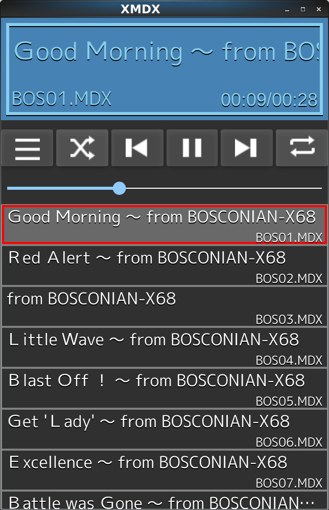
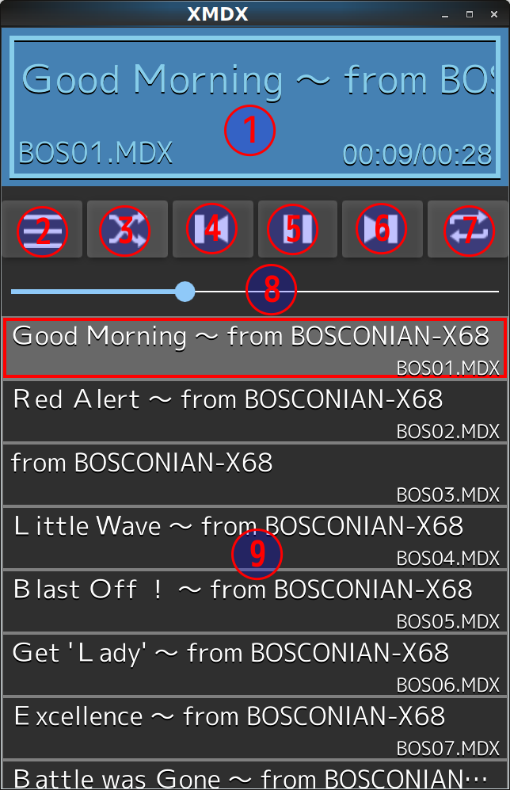

<link href="doc/markdown.css" rel="stylesheet"></link>
# MDXプレーヤー XMDX
by eighttails  

目次  

[TOC]

## はじめに
XMDXとは、かつてパソコン通信時代、SHARP X68000用に流通したMDX形式の音楽データを再生するためのアプリケーションです。  
Linux及びAndroidをターゲットとして開発していますが、Qtが動く環境であればだいたい動くと思います。  

## 使用方法
### 前提条件
当然ですが、再生する対象のMDXファイルをお手持ちの端末にコピーしてください。  
Androidの場合は、アクセス権の問題を避けるため、SDカードにコピーしたほうが無難でしょう。
### 基本的な使い方  
まずは自分の再生したいMDXファイルをプレイリストに入れるところから始めます。  
メニューから「ファイルを追加」または「フォルダを追加」を選択し、MDXファイルがコピーされている場所を指定してください。
プレイリストに音楽ファイルが登録されたら(曲名が表示されたら)曲をタップすると再生されます。
音量は本体のボリュームから調節してください。
### 画面説明
画面の各部の説明  

1. 曲情報表示パネル  
現在再生中の曲名、ファイル名、曲長を表示します。  
1. メニューボタン  
メニューを表示します。  
1. シャッフルボタン  
シャッフル再生を有効にします。  
1. 曲戻しボタン  
曲の先頭に戻ります。曲の再生直後に押した場合は前の曲に戻ります。  
1. 再生/停止ボタン  
曲の再生、停止を行います。  
1. 曲送りボタン  
現在再生中の曲をスキップして次の曲に移ります。  
1. リピート再生ボタン  
リピート再生を有効にします。プレイリスト全体のリピート機能のみです。(1曲リピート機能はありません)
1. スライダー
現在再生中の曲の再生位置を示します。ドラッグすることでシークすることができます。  
1. プレイリスト
現在曲が登録されているプレイリストを表示します。  
曲をタップすることでその曲を再生することができます。  
わかりにくいですが、右端がスクロールバーになっています。右端を縦になぞることで、長いスクロールができます。

### メニュー
メニューボタンを押すと以下の機能が呼び出せます。

* 新規プレイリスト  
現在のプレイリストを追加します。
* ファイルを追加  
現在のプレイリストに単一のMDXファイルを追加します。
* フォルダを追加  
現在のプレイリストに選択したフォルダ内のMDXファイルを追加します。  
サブフォルダにあるファイルも含めてプレイリストに追加が行われます。

## FAQ

## 今後の予定  
### やりたいと思っていること
### やらないこと

## 開発者情報
### ライセンス
### ビルド方法
Coming soon  
（メモ）QtRemoteObjectsが必要。  
<https://code.qt.io/cgit/playground/qtremoteobjects.git/>

## 更新履歴

## 謝辞

